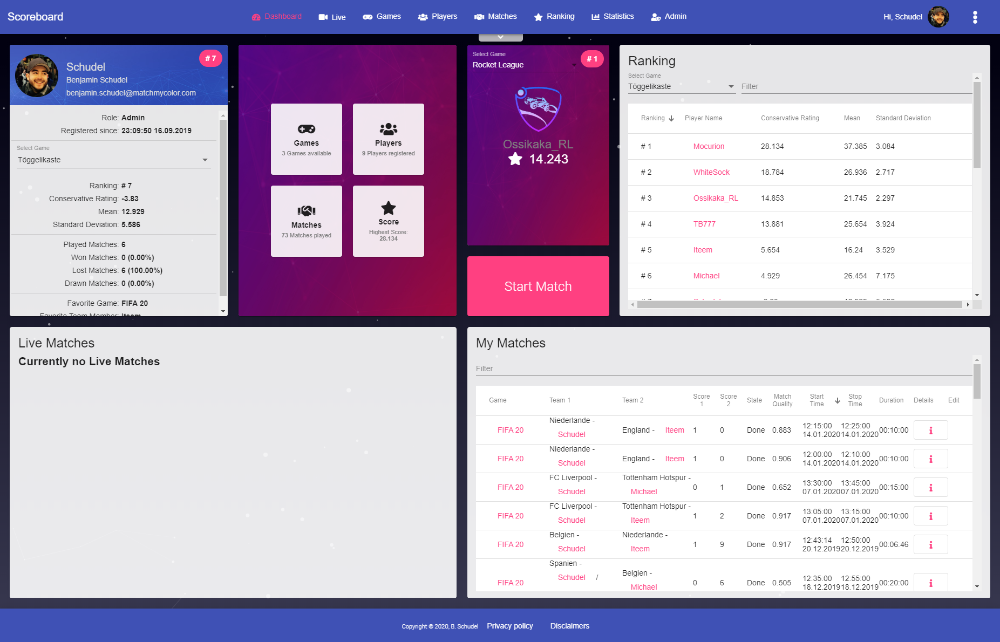
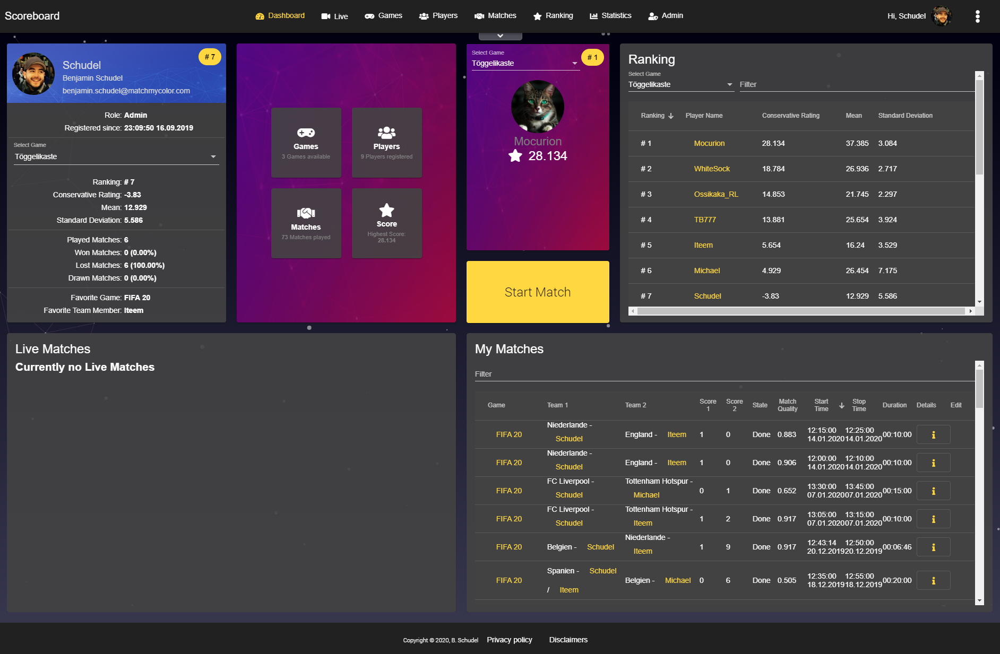
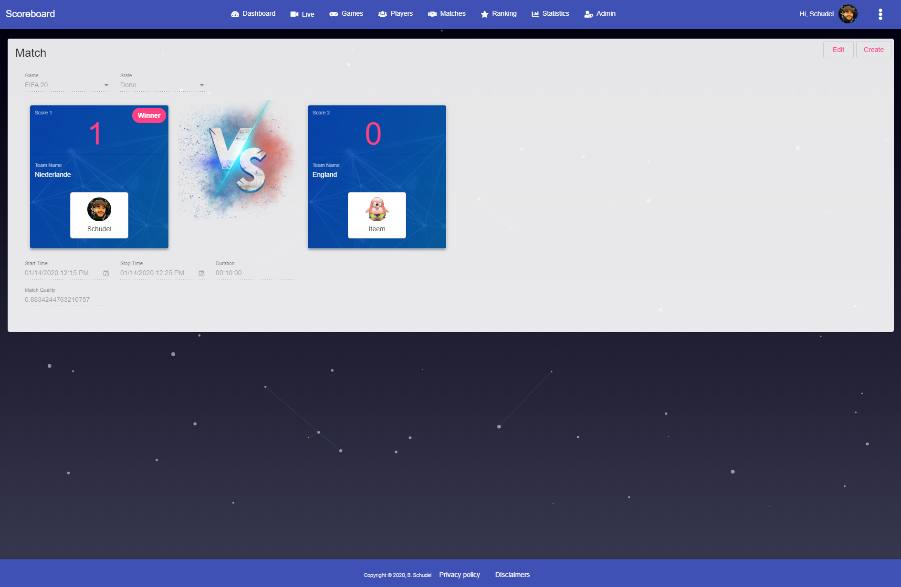
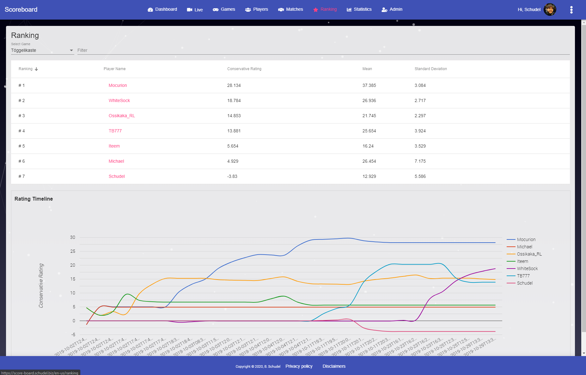
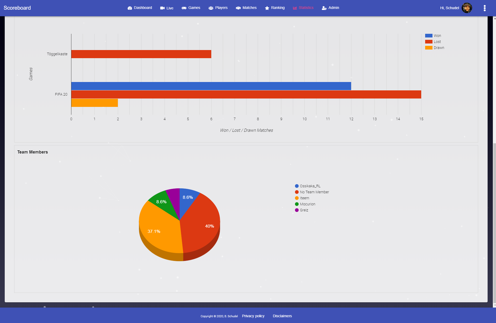
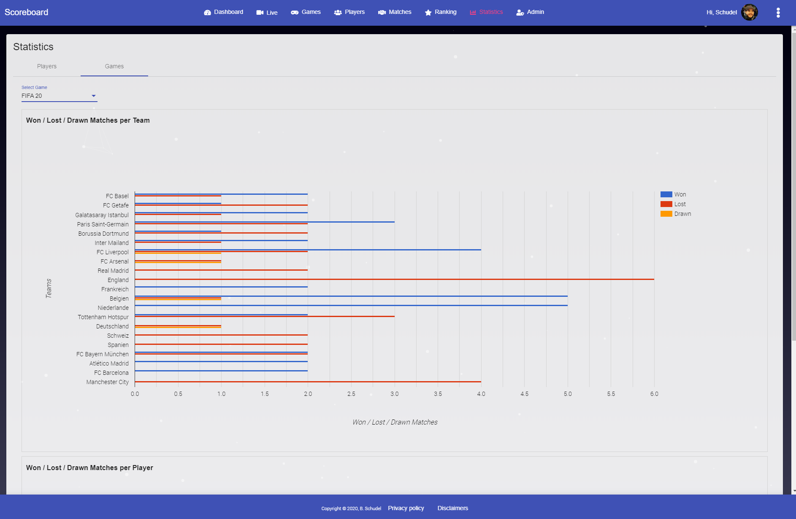
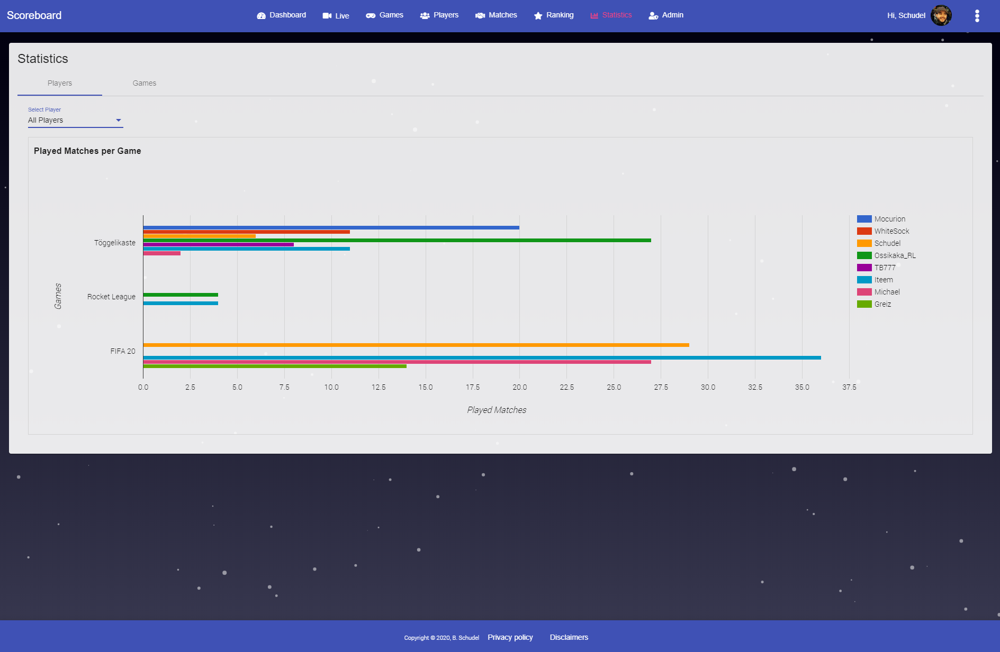

# Score-Board

> **Public Snapshot Notice:** This repository is a clean public snapshot. The original private Git history has **not** been published — all previously committed secrets (JWT key, database passwords, SMTP credentials, API keys) have been rotated and invalidated. No credentials are present in this codebase.

A full-stack score-tracking and live-match application.  
Players can register, log in, manage games and matches, track ratings, and watch live match updates in real time via SignalR.

> **Status:** Legacy / Personal Project. Built as a learning project. The application is functional but uses end-of-life runtimes (.NET Core 3.1, Angular 9). Upgrading dependencies is strongly recommended before any new deployment.

---

## Architecture Overview

```
┌─────────────────────────────────────────────────────────────┐
│  score-board-client  (Angular 9 SPA)                        │
│  - Player registration & login (JWT)                        │
│  - Match management, ratings, live view                     │
│  - Real-time chat & live updates via SignalR                │
│  - Giphy integration, Google reCAPTCHA                      │
│  - i18n: en-us, de-de, de-ch                               │
└─────────────────┬───────────────────────────────────────────┘
                  │ HTTP REST + WebSockets (SignalR)
┌─────────────────▼───────────────────────────────────────────┐
│  score-board-server  (.NET Core 3.1 Web API)                │
│  - JWT authentication                                       │
│  - REST controllers: Auth, Player, Team, Game,              │
│    Match, LiveMatch, Rating, Chat                           │
│  - SignalR Hubs: ChatHub, LiveHub                           │
│  - NHibernate ORM → MS SQL Server                          │
│  - Serilog structured logging                               │
│  - Swagger / OpenAPI documentation                          │
└─────────────────────────────────────────────────────────────┘

┌─────────────────────────────────────────────────────────────┐
│  score-board-redirect  (Angular 9 SPA)                      │
│  - Minimal app served at the root domain                    │
│  - Redirects visitors to the correct locale-prefixed URL    │
│    (e.g. /en-us/, /de-de/, /de-ch/)                        │
└─────────────────────────────────────────────────────────────┘
```

---

## Project Structure

```
score-board/
├── score-board-client/      # Angular 9 main application
│   └── src/
│       ├── app/             # Components, services, guards, pipes
│       ├── environments/    # Environment config (no secrets here)
│       └── locale/          # i18n translation files
├── score-board-redirect/    # Angular 9 redirect app
│   └── src/
│       ├── app/
│       └── environments/
└── score-board-server/      # .NET Core 3.1 solution
    ├── ScoreBoard.API/       # ASP.NET Core Web API (entry point)
    ├── ScoreBoard.Domain/    # Domain models & enums
    ├── ScoreBoard.Infrastructure/  # NHibernate mappings & repositories
    ├── ScoreBoard.Services/  # Use cases, adapters, helpers (email, password)
    ├── ScoreBoard.Fakes/     # Test fakes / fake data
    ├── ScoreBoard.Init/      # One-time database initialization (test facts)
    ├── ScoreBoard.API.Facts/ # Integration tests (xUnit)
    ├── ScoreBoard.Domain.Facts/
    └── ScoreBoard.Services.Facts/
```

---

## Prerequisites

| Tool | Version | Notes |
|------|---------|-------|
| Node.js | 12.x | Required for Angular 9 |
| npm | 6.x+ | Bundled with Node.js |
| Angular CLI | 9.x | `npm install -g @angular/cli@9` |
| .NET Core SDK | 3.1 | [Download](https://dotnet.microsoft.com/download/dotnet/3.1) |
| SQL Server | Any (e.g. Express) | Or configure a connection string |

> **TODO:** Verify exact Node.js version constraint from `browserslist`.

---

## Configuration

### Backend – User Secrets (recommended for local dev)

Never put real secrets into `appsettings.json`. Use .NET User Secrets instead:

```bash
cd score-board-server/ScoreBoard.API

# Initialize user secrets
dotnet user-secrets init

# Set the JWT signing secret (min. 32 characters recommended)
dotnet user-secrets set "AppSettings:Secret" "your-strong-jwt-secret-here"

# Set the database connection string
dotnet user-secrets set "AppSettings:DbConnectionString" "Server=localhost\\SQLEXPRESS;Initial Catalog=ScoreBoard;User=sa;Password=yourpassword;"
```

The values in `appsettings.json` and `appsettings.Development.json` use placeholder tokens (`{mySecretKey}`, `{myDbConnectionString}`) that must be overridden via User Secrets or environment variables before the application will work.

### Backend – Environment Variables (for CI/Docker)

```bash
export AppSettings__Secret="your-strong-jwt-secret-here"
export AppSettings__DbConnectionString="Server=...;..."
```

### Frontend – Environment Files

Copy the template and fill in your values:

```
score-board-client/src/environments/environment.ts          # dev
score-board-client/src/environments/environment.prod.ts     # prod build
```

| Variable | Description |
|----------|-------------|
| `scoreBoarServerUrl` | URL to the backend API |
| `recaptchaSiteKey` | Google reCAPTCHA v2 **site key** (public, safe to include in frontend builds) |
| `scoreBoardRedirectUrl` | URL of the redirect app |

> ⚠️ The `recaptchaSiteKey` in `environment.prod.ts` is a **site key** (public by design). However, reCAPTCHA verification **must be completed server-side** using the secret key, which must never be exposed in frontend code.

### Email Service

SMTP configuration is currently hardcoded in `EmailService.cs` as constants. Before deploying:

1. Move SMTP settings (`SmtpServer`, `Username`, `Password`, `SenderEmailAddress`) to `appsettings.json` / User Secrets.
2. Inject `IOptions<SmtpSettings>` instead of hardcoded constants.

---

## Local Development Setup

### 1. Start the Backend

```bash
cd score-board-server

# Restore dependencies
dotnet restore

# Configure secrets (see Configuration section above)
# Then run:
dotnet run --project ScoreBoard.API
```

The API will be available at:
- `https://localhost:5001` (HTTPS)
- `http://localhost:5000` (HTTP)
- Swagger UI: `https://localhost:5001/swagger`

### 2. Start the Frontend

```bash
cd score-board-client

# Install dependencies
npm install

# Start development server (English locale)
npm start
# or
npm run start:de-de    # German (Germany)
npm run start:de-ch    # German (Switzerland)
```

The app will be available at `http://localhost:4200`.

### 3. Start the Redirect App

```bash
cd score-board-redirect

npm install
npm start
```

---

## Build

### Frontend

```bash
# Single locale (en-us)
npm run build:en-us

# All locales
npm run build-locale

# Production build
npm run deploy
```

Output is written to `dist/`.

### Backend

```bash
cd score-board-server
dotnet build
dotnet publish -c Release -o ./publish
```

---

## Tests

### Backend

```bash
cd score-board-server

# Run all test projects
dotnet test

# Run specific project
dotnet test ScoreBoard.Domain.Facts
dotnet test ScoreBoard.Services.Facts
dotnet test ScoreBoard.API.Facts
```

### Frontend

```bash
cd score-board-client

# Watch mode (default)
npm test

# Single run (CI)
npm run tc-test
```

```bash
cd score-board-redirect
npm test
```

---

## Database Initialization

The `ScoreBoard.Init` project contains one-time initialization facts (seeding test data). These are marked `[Fact(Skip = "Only for Initialization")]` and must be run manually:

```bash
cd score-board-server
# Configure connection string in ScoreBoard.Init/Constants.cs (or via env)
dotnet test ScoreBoard.Init
```

> ⚠️ Do **not** hardcode real connection strings in `Constants.cs`. Use environment variables or a `.runsettings` file.

---

## Deployment Notes

> **TODO:** Add deployment scripts / CI workflow when known.

- The backend targets .NET Core 3.1 (EOL December 2022). Upgrade to .NET 8+ is strongly recommended.
- Angular 9 is EOL. Upgrade to Angular 17+ is recommended.
- Configure `ASPNETCORE_ENVIRONMENT=Production` in production.
- Set `RequireHttpsMetadata = true` in JWT Bearer options for production.
- Enable HSTS in production (already present in `Startup.cs`, triggered when not in Development).
- Configure CORS `WithOrigins(...)` to your actual production domain.

---

## Security Notes

- **No secrets in source code.** All secrets are managed via .NET User Secrets (local) or environment variables / GitHub Secrets (CI/CD).
- **JWT tokens expire after 7 days.** Adjust `Expires` in `AuthenticationController.cs` as needed.
- **SMTP credentials** must be injected via configuration, never hardcoded.
- **reCAPTCHA** server-side verification must be implemented in the backend, not in the Angular service.
- See [SECURITY.md](SECURITY.md) for the responsible disclosure policy.

---

## License

MIT License – see [LICENSE](LICENSE).

---

## Screenshots

### Dashboard - Light



### Dashboard - Dark



### Live Match



### Ranking



### Statistics





